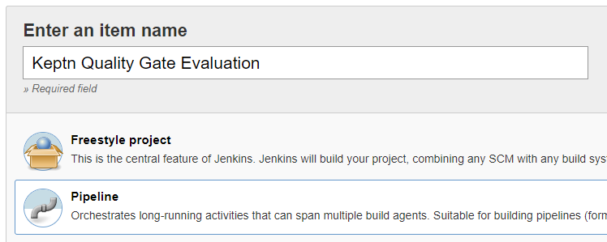
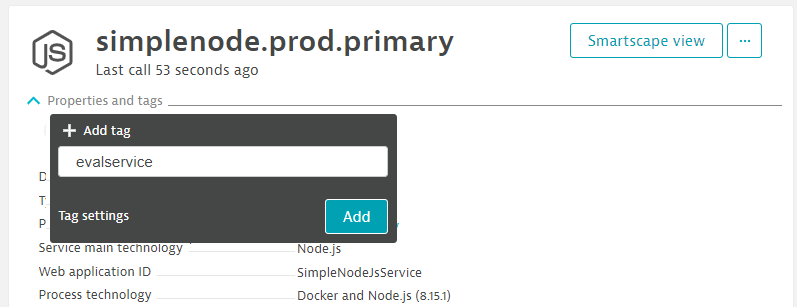
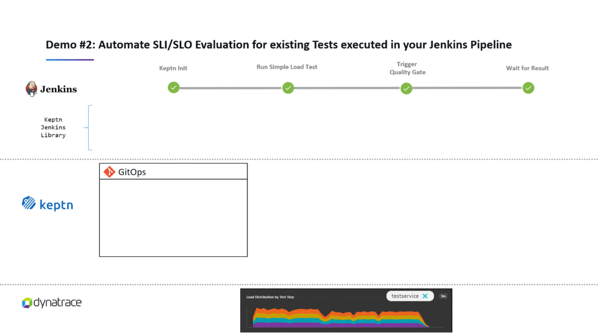
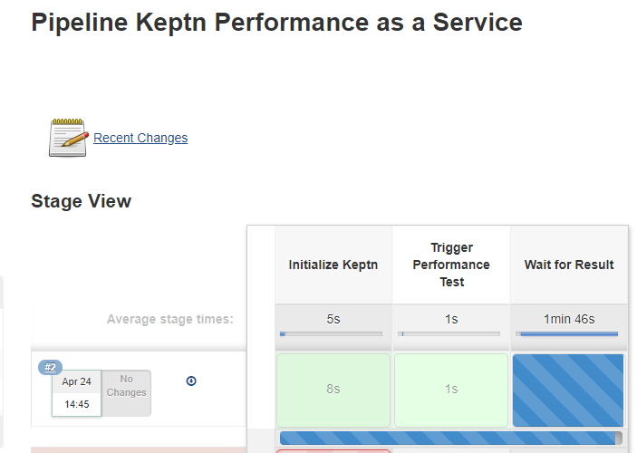
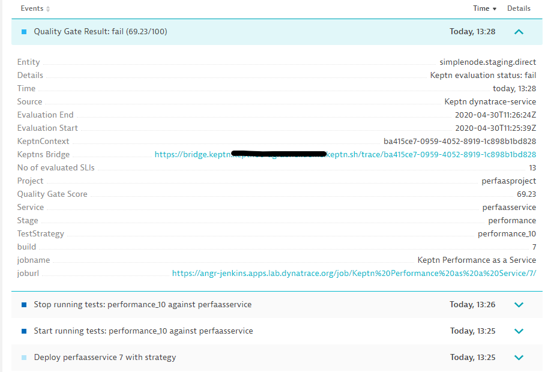
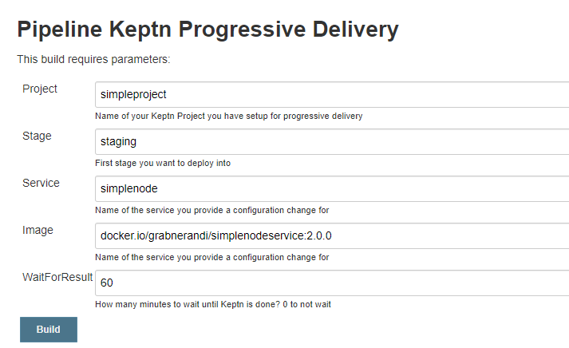
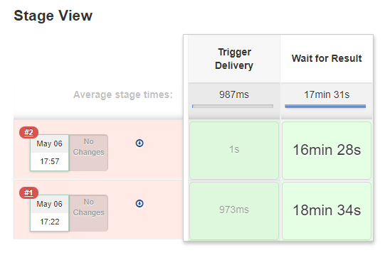

# Tutorials and Samples for Integrating Jenkins with Keptn

| Author | Keptn-Version |
| ------ | ------------- |
| grabnerandi | 0.6.1 |

The goal of this repository is to describe integration use cases of Keptn with Jenkins. As there are many integration scenarios and also different ways to integrate Keptn with Jenkins we also collect different approaches, scripts, plugins, ... that the community is building to support these use cases.

If you have built your own scripts or plugins please let us know. Feel free to add your custom scripts to the scripts subfolder by issuing a Pull Request (PR)

## Watch the tutorial webinar on YouTube

As part of a Keptn Community Webinar we walked through most of these use cases (click image to play video):

[](https://www.youtube.com/watch?v=VYRdirdjOAg "Level Up your Jenkins with Keptn Video Tutorial")

## Use Case Overview (work in progress)

| Use Case | Description |
| ------ | ------------- |
| Integrate Keptn's SLI/SLO-based Quality Gates in your existing Jenkins Pipeline | If your pipeline already deploys and runs tests you can invoke the Keptn Quality Gate by send a start-evaluation event, wait until evaluation-done event is available and use the result to fail or succeed your Jenkins Pipeline |
| Integrate Keptn's Performance Testing as a Self-Service in your Jenkins Pipeline | If your pipeline already deploys you can let Keptn automate test execution and Quality Gate Evaluation by sending a deployment-finished event from your Jenkins Pipeline |
| Keptn invokes Jenkins pipelines for Deployment | If you have Jenkins pipelines that deploys your application you can use Keptn to orchestrate the end-2-end continuos delivery process but invoking your Jenkins Pipeline to do the actual deployment of the artifact/app |
| Keptn invokes Jenkins pipelines for Test Execution | If you have Jenkins pipelines that tests your application you can use Keptn to orchestrate the end-2-end continuos delivery process but invoking your Jenkins Pipeline to do the actual testing of the artifact/app |

## 1.1 Integrate Keptn's SLI/SLO-based Quality Gates

This is a straight forward use case where your Jenkins Pipeline simply triggers an SLI/SLO-based Quality Gate Evaluation in Keptn. This can either be done through the Keptn CLI or the API. To make this easier we can also use the [Keptn Jenkins Shared Library](https://github.com/keptn-sandbox/keptn-jenkins-library)!


**Pre-Req: Install Keptn Jenkins Library and Create Sample Pipeline**
The Keptn Jenkins Shared Library provides a lot of helper functions to connect your Jenkins Pipeline with a Keptn Project and allows you to easily trigger the Keptn Quality Gate. All you need is
1. A Jenkins Server with the installed [Keptn Jenkins Shared Library](https://github.com/keptn-sandbox/keptn-jenkins-library). Make sure you follow all instructions on that GitHub page
2. Create a new Jenkins Pipeline and call it e.g: "Keptn Quality Gate Evaluation"

3. Now either SCM reference or copy/paste [keptnevaluation.Jenkinsfile](./usecases/uc1_qualitygates/keptnevaluation.Jenkinsfile) into your pipeline definition


**SLI Monitoring Tool Information**
This example comes with a pre-defined set of SLIs and SLOs for Dynatrace. If you want to use a different monitoring tool simply change the SLI.yaml to e.g: pull this data from Prometheus. To find out more about setting up Prometheus and defining SLIs for Prometheus to be used with Keptn please check out the [Quality Gate Tutorials for Prometheus](https://tutorials.keptn.sh/?cat=prometheus).

**Pre-Reqs With Dynatrace**
If you want to just follow along with Dynatrace then make sure you have any type of application deployed and monitored by a Dynatrace OneAgent. If you don't have Dynatrace yet just sign up for the [Dynatrace SaaS trial](http://bit.ly/dtsaastrial).
You also need to have the configured Keptn to use Dynatrace by installing the Dynatrace-Service. If you havent done it yet - please follow the doc: https://keptn.sh/docs/0.6.0/reference/monitoring/dynatrace/

*Tagging your application in Dynatrace*
My SLI.yaml uses tags to identify the service you want to pull your SLI data from. The name of the tag can be passed to our Jenkins Pipeline as a parameter. The default value is "evalservice" which means you only need to place a tag on your service you want to have evaluated with that name. Like shown in the following screenshot:


**Action: Execute the pipeline**
Now we are good to go to execute the Jenkins Pipeline to trigger our Quality Gates:
1. The first execution of the pipeline will fail with an error such as "no property monitoring" defined. This is because Jenkins by default doesnt scan the pipeline for parameters and there are several that have to be specified. THATS OK :-)
2. Once failed, refresh the Jenkins pipeline view and now click on "Build with Parameters" and go with the following defaults:


After the first successful run is done you should see your Jenkins Pipeline View like this:


In the Console Output you can find a deep link to the Keptns Bridge for this quality gate evaluation:


The heatmap will look something like this - showing all the results of all your runs with all details on the individual SLIs & SLO evaluation results. I took my screenshot after I ran a couple of tests already. So - the more often you run you pipeline the more results you will get as each evaluation you trigger will show up here:


Additionally to exploring the results in the Bridge you can also explore the raw data in your Jenkins Pipeline as the Jenkins Shared Library has archived not only SLI & SLO but also the keptnContext as well as the evaluation result JSON output:


**Summary**
This sample pipeline shows you how you can trigger an evaluation for a specific timeframe! Take this as an example and integrate this into your own delivery pipeline!

## 1.2 Integrate Keptn's SLI/SLO-based Quality Gates - With Simple Testing Tool in Pipeline

This is an extended version of example 1.1 where the pipeline also has a very simple load-testing capability built-into one of the stages.



**Pre-Req: Install Keptn Jenkins Library and Create Sample Pipeline**
The setup is similar to the previous pipeline. You need
1. A Jenkins Server with the installed [Keptn Jenkins Shared Library](https://github.com/keptn-sandbox/keptn-jenkins-library). Make sure you follow all instructions on that GitHub page
2. Create a new Jenkins Pipeline and call it e.g: "Simple Load Test with Keptn Quality Gates"

3. Now either SCM reference or copy/paste [keptnevaluatewithtest.Jenkinsfile](./usecases/uc1_qualitygates/keptnevaluatewithtest.Jenkinsfile) into your pipeline definition


**Pre-Reqs With Dynatrace or switch to Prometheus**
This tutorial has the same pre-reqs on Dynatrace as the 1.1. So - please make sure you Keptn either has the Dynatrace Service and Dynatrace SLI Provider installed and configured or change it to Prometheus.

*Tagging your application in Dynatrace*
For this example the default value of the Keptn service name which will be used in my SLI.yaml to identify the Dynatrace monitored service is different. It is called *testservice*. So - go ahead and make sure the service in Dynatrace you want to pull SLI metrics from has the *testservice* tag on it. As shown here in my case:


*Calculated Service Metrics for Test Execution*
The pipeline comes with two types of SLI.yamls. One with basic metrics and one with perftest metrics. If you use the perftest version the SLI.yaml contains additional Dynatrace Calculated Service metrics that provide data such as "Failure Rate split by Test Name" or "Number of Service Calls split by Test Name". This shows you the power of the Dynatrace Calculated Service metrics in combination with testing tools that can pass context such as Test Name, Test Script, Load Test Name ... to Dynatrace as part of the HTTP Request. 
If you want to use that perftest SLI make sure you have the necessary calculated service metrics created. If you dont want to create them yourself - here is a script you can execute which automates that creation: [createTestStepCalculatedMetrics.sh](./scripts/createTestStepCalculatedMetrics). You can call it like this
```
./createTestStepCalculatedMetrics.sh CONTEXTLESS testservice
```
This script will create 4 calculated service metrics for those Dynatrace Services with the tag testservice on it. If you want to have these calculated service metrics available for other services as well simply define it for a broader set of tag. You can also edit these metric definitions in the Dynatrace UI to expand the scope for other services!

**Action: Execute the pipeline**
Same as with 1.1. The first pipeline run will fail as Jenkins doesnt automatically parse the parameters which doesnt give you the "run with Parameters" option. Once you have that option after refreshing the screen after the first failed run you can run the pipeline with the default parameters BUT PLEASE - make sure you change change the URL to your own application that you are monitoring :-)
!()(./images/simpletestpipeline_executewithparameters.png)

Once the execution is done you will see a Jenkins Output like this:


And the heatmap in the Keptns Bridge will now inlcude all these additional metrics specified in the perftest SLI:


## 2. Integrate Keptn's Performance Testing as a Self-Service in your Jenkins Pipeline

This tutorial extends tutorial 1.2 where we had Jenkins execute a simple test as part of the Jenkins Pipeline and Keptn was then used for SLI/SLO based quality-gate evaluation. In this tutorial we use Keptn to also take care of the actual test execution using JMeter. If you want to replace JMeter with another tool, e.g: Neotys - then simply replace the *jmeter-extended-service* with the [*neoload-service*](https://github.com/keptn-contrib/neoload-service/)


**Pre-Req: Install Keptn Jenkins Library and Create Sample Pipeline**
The setup is similar to the previous pipeline. You need
1. A Jenkins Server with the installed [Keptn Jenkins Shared Library](https://github.com/keptn-sandbox/keptn-jenkins-library). Make sure you follow all instructions on that GitHub page
2. Create a new Jenkins Pipeline and call it e.g: "Keptn Performance as a Service"
3. Now either SCM reference or copy/paste [keptnperftesting.Jenkinsfile](./usecases/uc1_qualitygates/keptnperftesting.Jenkinsfile) into your pipeline definition


**Pre-Reqs With Dynatrace or switch to Prometheus**
This tutorial has the same pre-reqs on Dynatrace as the 1.1. So - please make sure you Keptn either has the Dynatrace Service and Dynatrace SLI Provider installed and configured or change it to Prometheus.

*Tagging your application in Dynatrace*
For this example the default value of the Keptn service name which will be used in my SLI.yaml to identify the Dynatrace monitored service is different. It is called *perfaasservice*. So - go ahead and make sure the service in Dynatrace you want to pull SLI metrics from has the *perfaasservice* tag on it. As shown here in my case:


*Calculated Service Metrics for Test Execution*
Just as in tutorial 1.2, the pipeline comes with two types of SLI.yamls. One with basic metrics and one with perftest metrics. If you use the perftest version the SLI.yaml contains additional Dynatrace Calculated Service metrics that provide data such as "Failure Rate split by Test Name" or "Number of Service Calls split by Test Name". This shows you the power of the Dynatrace Calculated Service metrics in combination with testing tools that can pass context such as Test Name, Test Script, Load Test Name ... to Dynatrace as part of the HTTP Request. 
If you want to use that perftest SLI make sure you have the necessary calculated service metrics created. If you dont want to create them yourself - here is a script you can execute which automates that creation: [createTestStepCalculatedMetrics.sh](./scripts/createTestStepCalculatedMetrics). You can call it like this
```
./createTestStepCalculatedMetrics.sh CONTEXTLESS perfaasservice
```
This script will create 4 calculated service metrics for those Dynatrace Services with the tag testservice on it. If you want to have these calculated service metrics available for other services as well simply define it for a broader set of tag. You can also edit these metric definitions in the Dynatrace UI to expand the scope for other services!
**ATTENTION**: if you have executed this script as part of a previous tutorial simple edit the Calculated Service Rules in Dynatrace and add an extra condition for service tag *perfaaservice*. This will make sure Dynatrace also calculates the metrics for your newly tagged services.

**Action: Execute the pipeline**
Same as with the previous tutorials: The first pipeline run will fail as Jenkins doesnt automatically parse the parameters which doesnt give you the "run with Parameters" option. Once you have that option after refreshing the screen after the first failed run you can run the pipeline with the default parameters BUT PLEASE - make sure you change the URL to your own application that you are monitoring :-)
!()(./images/pipeline_perfaas_executewithparameters.png)

Once the execution is done you will see a Jenkins Output like this:


And the heatmap in the Keptns Bridge will now inlcude all these additional metrics specified in the perftest SLI:


**Action: Run different types of tests**
If you want to leverage the option to execute different types of workloads you can install the [JMeter Extended Service](https://github.com/keptn-contrib/jmeter-extended-service) which provides support for custom workloads. In my tutorial I am already uploading a *jmeter.conf.yaml* which defines additional workloads that can be triggered by passing in a different *TestStrategy* parameter, e.g: performance_10 or performance_100 will call the same load.jmx file but will pass it different parameters for VUCount or LoopCount.
Give it a try and run the pipeline again and select a differnet *TestStrategy*

**Explore the Dynatrace Events**
By default the *dynatrace-service* will send deployment, start/stop tests and quality gate evaluation result events to Dynatrace. In the *dynatrace-service* version that comes with Keptn 0.6.1 it will however only do it for services that are tagged with keptn_project, keptn_service & keptn_stage on the Dynatrace side. 
There is a new version of *dynatrace-service* available that you can try for Keptn 0.6.1. This version is available through the following feature branch: https://github.com/keptn-contrib/dynatrace-service/tree/feature/115_116/support_non_keptn_deployed_service. The plan is to merge this feature branch to Keptn core soon - so - watch out - it might already be installed in your Keptn cluster :-)

Now - lets explore some of these events the *dynatrace-service* sends over:


## 3. Jenkins Builds a Container and triggers Keptn for Progressive Delivery

If you have a Jenkins Pipeline that builds your code, packages it in a container and uploads it to a container registry then you can use Keptn for Progressive Delivery of that artifact (=container image). All you need is a configured Keptn Project where you have already onboarded your services including Helm charts, SLIs/SLOs, tests ...
In order to setup such a Keptn project please follow one of the [Full Keptn Tour Tutorials](https://tutorials.keptn.sh/)

Normally you would trigger Keptn through the Keptn CLI or the API and inform it about a new artifact, e.g:
```
keptn send event new-artifact --project=PROJECTNAME --service=SERVICENAME --image=docker.io/keptnexamples/carts --tag=0.9.1
```
The [Keptn Jenkins Shared Library](https://github.com/keptn-sandbox/keptn-jenkins-library) allows you to trigger the same workflow from your Jenkins Pipeline.
If you want to give this a try you can either SCM reference or copy/paste [keptndelivery.Jenkinsfile](./usecases/uc2_progressivedelivery/keptndelivery.Jenkinsfile) into your pipeline definition

If you execute it you will see that this pipeline requests all the information you would normally pass to *keptn send event new-artifact*:


Once you execute that pipeline it will trigger a full Keptn delivery workflow which - depending on how many stages your have defined in your shipyard and how long the tests take to execute - may take a couple of minutes:


## 4. Keptn invokes Jenkins pipelines for Deployment 

The *jenkins-service* allows you to invoke any Jenkins Pipeline when handling specific Keptn events, e.g: deploy, test, evaluation, promote or notify.
A more detailed tutorial is coming shortly - in the meantime - have a look at the [Jenkins Service for Keptn](https://github.com/keptn-sandbox/jenkins-service/)


## 5. Keptn invokes Jenkins pipelines for Testing

The *jenkins-service* allows you to invoke any Jenkins Pipeline when handling specific Keptn events, e.g: deploy, test, evaluation, promote or notify.
A more detailed tutorial is coming shortly - in the meantime - have a look at the [Jenkins Service for Keptn](https://github.com/keptn-sandbox/jenkins-service/)

## 6. Further examples

**Example 1: Simple Integration via Jenkins httprequest plugin**
If you dont want to use the Jenkins Shared Library you can do it by calling the Keptn API directly in your pipeline!
One way of doing this is shown in the sample [Jenkins Pipeline file](./usecases/uc1_qualitygates/httprequest.Jenkinsfile) that [Leon Van Zyl](https://github.com/leonvzGit) contributed to this tutorial. Leon has shared a part of a Jenkins Pipeline that executes a Gatling test, sends a Keptn start-evaluation event for the timeframe of the test execution and then waits for the evaluation to be done!
